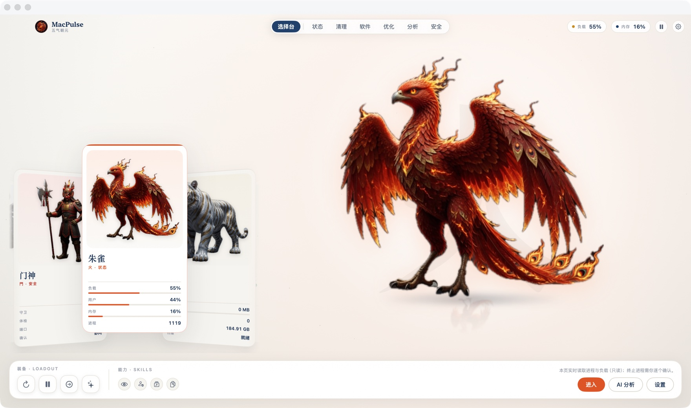
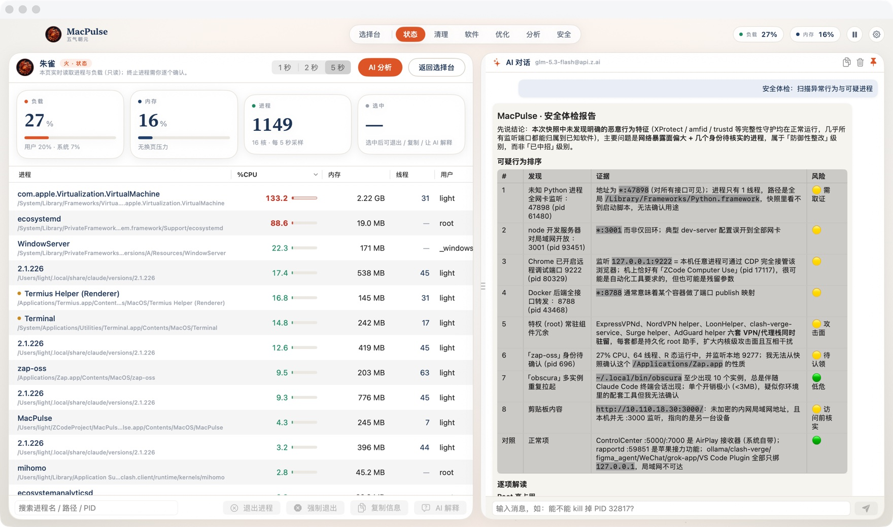

<div align="center">

# ⚡️ MacPulse AI

**AI 驱动的 macOS 进程管家 · AI-powered macOS process manager**

实时进程监控 · AI 安全体检 · 磁盘清理 · 应用卸载 · 受控终端 Agent
Live process monitor · AI security audits · Disk cleanup · App uninstaller · Controlled terminal agent

[](https://github.com/ChenYCL/MacPulseAI/releases)
[](#-testing)
[](LICENSE)
[](https://github.com/ChenYCL/MacPulseAI/releases)

**[下载 Download](https://github.com/ChenYCL/MacPulseAI/releases/latest)** · [English](#-english) · [功能特性](#-功能特性) · [架构](docs/PRD.md)

</div>

---

## 🇨🇳 中文介绍

### 这是什么？

MacPulse AI 是一款开源、免费、原生（Swift + SwiftUI，零第三方依赖）的 macOS 系统管理工具：它把「活动监视器 + CleanMyMac + iStat」的能力合而为一，并内置 AI Agent——你可以用自然语言问「哪些进程可以杀」「磁盘为什么满了」，AI 会给出分析、证据和**需要你亲自确认才会执行**的操作建议（HITL，human-in-the-loop）。

<p align="center">
  
  <br>
  <em>选择台：金木水火土門六界一界一位守护神兽，卡面直接读出该界的实时指标；底部装备栏可不进页就执行常用动作</em>
</p>

<p align="center">
  
  <br>
  <em>状态页：顶部四张大读数卡先给结论，下方实时进程表读出 <code>com.apple.Virtualization.VirtualMachine</code> 的真实瞬时 133.2%（多核累加，非生命周期均值）；右侧可拖拽宽度的 AI 侧边栏，终止/清理动作一律需人工确认</em>
</p>

### 功能特性

**📊 进程监控（Processes）**
- 真实**瞬时 CPU**（双采样差值，非生命周期均值——活动监视器都做不到的精度）
- CPU 迷你条形图、阈值标红；内存/线程/用户/完整路径；内存压力 + Swap 警示卡
- 搜索、多选、退出（SIGTERM）/强制退出（SIGKILL，带确认弹窗）；其他用户的进程自动保护

**🛡 安全中心（Security）**
- **AI 查毒（全系统体检）**：AI 汇总进程 + 全部 TCP 监听端口 + 磁盘 + 剪贴板 + 启动项做综合安全审计，输出可疑行为排序表（证据/风险 🟢🟡🔴）、逐项解读与处置建议
- **剪贴板体检**：本机识别 API 密钥 / PEM 私钥 / 钱包地址 / 高危 shell 命令（`rm -rf`、`curl|sh`…），脱敏展示 + 一键清空；「AI 查毒」按需把**脱敏后**内容送模型复审
- **启动项审计**：用户级 LaunchAgents 可安全移除（进废纸篓），全局项只读标注
- **安全钩子 SafetyGuard**：所有破坏性操作（删除/清理/维护/终止/shell）执行前强制裁决——路径黑名单拦截、运行中占用保护、规模异常需人工确认；每次裁决带「会发生什么/影响/如何恢复」说明卡并写入审计日志；**代码中不存在任何静默物理删除通道，删除一律进废纸篓**

**💾 磁盘管家（Disk）**
- 四类可再生垃圾：应用缓存 / 日志 / 开发缓存（Xcode·npm·gradle·playwright·CocoaPods）/ **CLI 历史版本包**（claude·cursor-agent·opencode，语义版本比较保留最新、运行中版本自动排除）
- Review-first：先看清单再勾选，全部移入废纸篓可恢复
- **应用卸载器**：13 类残留审查（Preferences/AppSupport/Containers/WebKit/HTTPStorages…）
- 维护动作：释放内存（purge）/ 刷新 DNS / **重建 Launch Services** / 清空废纸篓

**🔌 端口（Ports）**
- 谁在监听哪个端口一目了然；过滤、AI 解释该进程、HITL 终止——「谁占了 3000 端口」三秒定位

**🤖 AI 对话 Agent（全部页面 Pin 常驻）**
- 多轮对话 + 流式输出（SSE，OpenAI 兼容 & Anthropic 双协议）；Markdown 完整渲染（表格/代码块/列表）
- **受控终端 Agent**：模型可提议 shell 命令——只读命令（ls/du/cat/lsof…）自动执行并把输出回灌给模型续答；写操作需你确认；危险命令（rm/sudo/管道执行）硬拦截并给替代方案
- **HITL 动作卡**：AI 建议的每个终止/清理操作都是独立确认卡（进程名/PID/SIGTERM-SIGKILL 语义），确认前绝不执行；被建议的进程在左侧表格**标红置顶**
- `<tool name="snapshot"/>` 数据新鲜度工具环；对话历史跨重启持久化；面板可拖拽调宽（320–860pt，双击复位）

**🌍 双语**：界面与 AI 输出均支持 中文 / English，跟随系统并可手动切换。

### 安装

```bash
# 下载 DMG（或 brew 待收录）
# https://github.com/ChenYCL/MacPulseAI/releases/latest
```

1. 打开 DMG，把 **MacPulse AI** 拖入 Applications
2. 首次打开：右键 → 「打开」（绕过 Gatekeeper 未公证提示）
3. 设置 → 填入 OpenAI 兼容或 Anthropic 的 Base URL / API Key / 模型名（z.ai、DeepSeek、本地 Ollama 等任何兼容网关均可），点「测试连接」

<details>
<summary>从源码构建 Build from source</summary>

```bash
git clone https://github.com/ChenYCL/MacPulseAI && cd MacPulseAI
./scripts/build_app.sh && open build/MacPulse.app
swift test   # 90 个单元测试
```
要求：macOS 13+ / Xcode 15+（Swift 6 工具链亦可编译，语言模式 v5）。

</details>

### 🧪 Testing

90 个单元测试覆盖：瞬时 CPU 数学（多核夹取/PID 复用回退）、ps/libproc 解析、两种 LLM 协议的流式 SSE 与错误事件（对照官方规范）、HITL 动作解析、SafetyGuard 拦截矩阵、剪贴板模式与脱敏、卸载器残留匹配、版本过滤、启动项扫描、Markdown 解析、设置持久化（0600）。另有 `tools/mock_llm.py` 本地双协议 mock 供无 Key 集成测试。

### 性能

自建 app 自身开销：空闲 **~0–1% CPU**，每次采样瞬时冲到 ~5%（fork `ps` + libproc 补全路径/线程数），后台遮挡态 ~0.2%。

做法：立绘的 idle 动画走隐式动画交给渲染服务插值，而不是 `TimelineView` 逐帧重跑视图树；原画按显示尺寸做降采样桶缓存；进程表拆成 `Equatable` 视图，采样数值没变就整块跳过排序与重绘；离开状态页时进程全量采样降到 1/5 频率（只保留给 AI 和卡面计数用的快照）。

---

## 🇺🇸 English

**MacPulse AI** is an open-source, native (Swift + SwiftUI, zero third-party deps) macOS utility that merges Activity Monitor + CleanMyMac + iStat into one app with a built-in AI agent. Ask "which processes can I kill?" or "why is my disk full?" in natural language; the agent returns evidence-based analysis and **action proposals that only run after you explicitly confirm them** (human-in-the-loop).

<p align="center">
  
  <br>
  <em>The roster: one guardian beast per realm, each card reading that realm's live metrics; the loadout rail runs common actions without leaving the screen</em>
</p>

<p align="center">
  
  <br>
  <em>Status page: headline metric cards up top, live process table below, drag-resizable AI panel on the right — Markdown output, evidence-based findings, and every kill/clean action gated behind your confirmation</em>
</p>

### Feature Highlights

- **📊 Processes** — true *instantaneous* CPU via double sampling (not lifetime averages), mini CPU bars, memory pressure + swap warning cards, full executable paths, search & multi-select, SIGTERM/SIGKILL with confirmation; root processes protected.
- **🛡 Security** — *AI poison check*: a full-system audit across processes, ALL TCP listening ports, disk, clipboard and login items, producing a ranked suspicious-behavior table (evidence / 🟢🟡🔴 risk), per-finding explanations and remediation. Local clipboard scanning (API keys, PEM keys, wallet addresses, dangerous shell commands like `rm -rf`) with redacted previews and one-click clear. Login-items auditing with safe user-level removal. **SafetyGuard** gates every destructive op: path blacklists, in-use protection, oversized-batch confirmation, what/impact/recovery explanation cards and a full audit journal — no silent permanent-delete path exists in the codebase; deletions always go to the Trash.
- **💾 Disk** — four regenerable junk categories (app caches / logs / dev caches incl. Xcode·npm·gradle·playwright / **legacy CLI version bundles** like claude·cursor-agent·opencode with semantic-version newest-keep and running-build exclusion), review-first, everything to Trash; **app uninstaller** with 13 leftover-location review; maintenance actions (purge memory, flush DNS, **rebuild Launch Services**, empty Trash).
- **🔌 Ports** — see who listens where, filter, AI-explain the process, HITL terminate. "Who's on port 3000" answered in seconds.
- **🤖 AI agent (pinned on every tab)** — multi-turn streaming chat (SSE; OpenAI-compatible & Anthropic), full Markdown rendering (tables/code blocks), **controlled terminal agent**: read-only commands auto-execute with output fed back to the model; writes need confirmation; dangerous commands hard-blocked with alternatives. Every proposed kill/clean is a HITL card (process name/PID/signal semantics); suggested PIDs turn red and pin to the top of the process table. `<tool name="snapshot"/>` freshness loop; chat history persists across relaunch; drag-resizable panel (320–860pt, double-click reset).
- **🌍 Bilingual** — UI and AI output in 中文 / English, follows the system with manual override.

### Install

Grab the DMG from [Releases](https://github.com/ChenYCL/MacPulseAI/releases/latest), drag **MacPulse AI** to Applications, right-click → Open on first launch (unsigned ad-hoc build), then paste your OpenAI-compatible or Anthropic endpoint + key in Settings and hit *Test Connection*. Works with z.ai, DeepSeek, local Ollama — any compatible gateway.

### Performance

Self-overhead: **~0–1% CPU** idle, brief ~5% spikes per sampling tick (fork `ps` + libproc for paths/threads), ~0.2% when occluded.

How: idle character motion runs as an implicit animation interpolated by the render server rather than a per-frame `TimelineView` re-evaluating the view tree; artwork is downsampled and bucket-cached per display size; the process table is an `Equatable` view that skips sorting and redrawing when sample values are unchanged; full process enumeration drops to 1/5 cadence whenever the table isn't on screen.

### License

MIT © 2026 ChenYCL — [PRD & design docs](docs/PRD.md) · [Task PRD](docs/tasks-prd.md)
