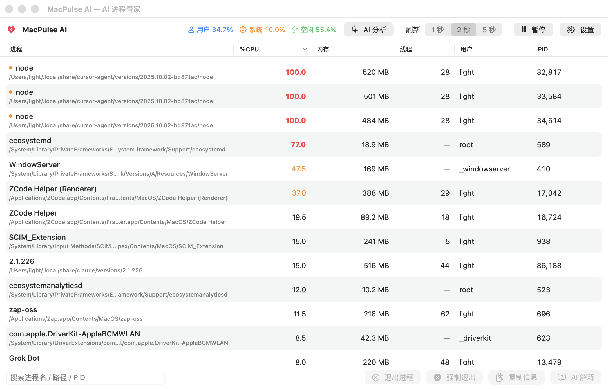

# ⚡️ MacPulse AI

**AI-powered macOS process manager & CPU monitor** — see what's eating your CPU, understand *why* with LLM analysis (OpenAI & Anthropic), and kill runaway processes safely.

**AI 进程管家**：实时监控 macOS 进程瞬时 CPU，用 LLM（OpenAI / Anthropic）解释"这些进程是什么、能不能杀"，并安全终止失控进程。

<p align="center">
  
</p>

## ✨ Features

- **Real-time monitoring** — per-process *instantaneous* CPU (double-sampling, not lifetime averages), memory, threads, user, full executable path; system CPU overview; menu-bar CPU% item.
- **Process management** — Quit (SIGTERM) / Force Quit (SIGKILL with confirmation showing name & PID), copy info; processes owned by other users are protected with clear hints; high-CPU rows highlighted (threshold configurable).
- **AI assistant** — send the top-N process snapshot to an LLM and get a structured Markdown report (Overall Assessment / Process Breakdown / Recommendations with 🔴🟡🟢 risk levels); per-process "Explain" too. AI only advises — it never kills anything.
- **Two LLM protocols** — OpenAI-compatible (any gateway/local server with `/v1/chat/completions`) and Anthropic (auto-appends `/v1/messages`, works with z.ai etc.); one-click "Test Connection"; config stored at `~/Library/Application Support/MacPulse/config.json` (chmod 600).
- **Bilingual UI** 🇨🇳/🇺🇸 — follows system language, overridable in Settings (自动 / 中文 / English). LLM prompts are localized too.
- **Native & light** — Swift + SwiftUI, zero third-party dependencies; ~0.2% CPU when the window is closed/occluded.

## 🚀 Build & Run

Requires Xcode / Swift 6 toolchain, macOS 13+.

```bash
./scripts/build_app.sh     # swift build -c release → build/MacPulse.app (ad-hoc signed, icon bundled)
open build/MacPulse.app
```

Development:

```bash
swift build    # debug build
swift test     # 22 unit tests
```

## 🧪 Testing

- **Unit tests** (`swift test`): ps line parsing (spaced ucomm / kernel processes / garbage rows), multi-format CPU TIME parsing, instantaneous CPU math (multi-core clamp, PID-reuse reset, first-sample fallback), AI prompt payloads (field completeness / path redaction / zh & en), both providers' request & response & error handling, settings persistence with 0600 permission check, language resolution.
- **Integration without a real API key**: `python3 tools/mock_llm.py 18787` serves both `/chat/completions` and `/v1/messages` (logs request bodies to `/tmp/macpulse_mock_llm.log`) to verify the full HTTP path and rendering.
- **End-to-end** (verified on this repo): spawn a `yes` CPU burner → it appears at ≈100% in the app → select → confirmation dialog → SIGKILL → gone from `pgrep`.

## 🔬 How sampling works

On macOS, `ps -o comm` truncates to 16 chars, `ucomm` may contain spaces, and there is no thread-count keyword — so text parsing alone is unreliable. MacPulse AI uses a hybrid:

1. `ps -axo pid=,user=,uid=,state=,time=,pcpu=,pmem=,rss=,ucomm=` (fixed single-token fields) — covers CPU time of root processes too;
2. `proc_pidpath` (libproc) — full executable paths (cached; works for most other-user processes);
3. `proc_pidinfo(PROC_PIDTASKINFO)` — thread counts (readable for your own processes only; others show "—");
4. **Instantaneous CPU% = Δ accumulated CPU time ÷ Δ wall clock** (first sample falls back to ps `pcpu`; PID reuse resets to 0; clamped to cores × 100).

## 📁 Project layout

```
Sources/MacPulse/     main.swift / AppView.swift / MonitorModel.swift / L10n.swift /
                      ProcessSampler.swift / SystemLoad.swift / LLMClient.swift /
                      SettingsStore.swift / ProcessKiller.swift / Models.swift
Tests/MacPulseTests/  ProcessSamplerTests / LLMClientTests / SettingsStoreTests
scripts/              build_app.sh (bundle + sign + icon) / make_icon.swift (icon generator)
tools/mock_llm.py     local dual-protocol mock LLM server
docs/PRD.md           product requirements & acceptance results (中文)
```

## 📝 Notes & limitations

- Other users' (root) processes cannot be terminated (elevation is out of scope for v1); their thread counts/paths may be unavailable due to system hardening — shown as "—".
- API keys are stored in plain text in the local config file (0600); Keychain migration planned.
- AI requests are non-streaming (30s timeout). The app costs ~4-5% CPU while the window is visible at 2s refresh (SwiftUI table rendering), ~0.2% when hidden.
- AI output is advisory only; terminating processes is always your call.

## 📄 License

MIT © 2026 ChenYCL
